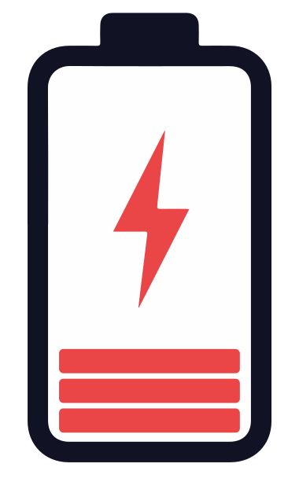

# Magic Warning

Use this graphics as a logo for the page 




## Description

The app will show a warning if the battery level of Apple Magic mouse, trackpad, and keyboard drops below 20%.

## Manual installation

- step1 
- step2
- Use the icon `Graphics/low_battery_graphics.icns`

## Installation from releases

-

## Periodic monitoring

- Download `org.alberti42.magic-warning-launcher.plist` in `<HOME>/Library/LaunchAgents`.
- Modify `ProgramArguments` to reflect the actual location where you install the `Magic Warning` app.
	```
	<key>ProgramArguments</key>
		<array>
			<string>/Applications/Magic Warnings.app/Contents/MacOS/applet</string>
		</array>
	```

## Donations

I would be grateful for any donation to support the development of this plugin.

[](https://buymeacoffee.com/alberti)

## Author

- **Author:** Andrea Alberti
- **GitHub Profile:** [alberti42](https://github.com/alberti42)
- **Donations:** [](https://buymeacoffee.com/alberti)

Feel free to contribute to the development of this plugin or report any issues in the [GitHub repository](https://github.com/alberti42/obsidian-plugins-annotations/issues).
