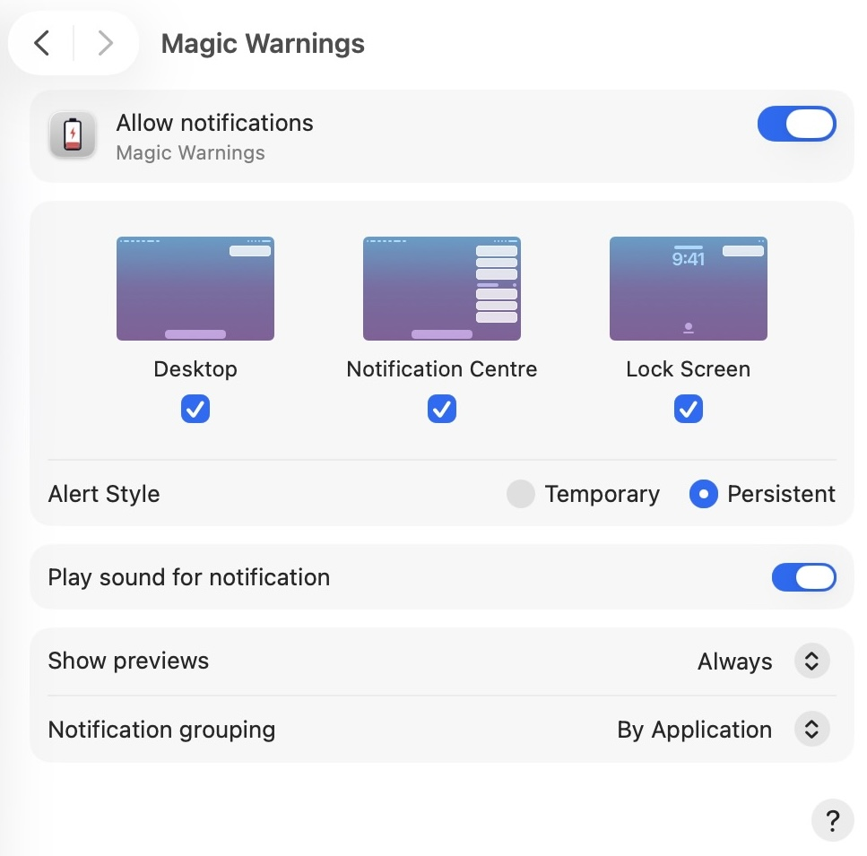

# Magic Warnings

## Description

**Magic Warnings** is a lightweight macOS app that monitors the battery levels of your Apple Magic Mouse, Trackpad, and Keyboard.

[](https://github.com/alberti42/Magic-Warnings/)

**Key features include:**

- Supports monitoring multiple Apple devices simultaneously, ensuring that you are notified for all connected devices.
- Displays a warning notification if the battery of any device drops below 20%.
- Battery levels are checked automatically every 10 minutes.
- Notifications are displayed every 3 hours if the battery remains below 20%.

## Manual Installation

To manually install **Magic Warnings** on your system:

1. Download the app from the [releases](#installation-from-releases) section.
2. Copy the `Magic Warnings.app` file to your `/Applications` folder (or your preferred location).
3. Remove the quarantine flag that macOS adds to files downloaded from the internet. This is necessary to allow the app to run:
   ```bash
   xattr -d com.apple.quarantine Magic\ Warnings.app
   ```
4. Launch the app.
5. In System Settings under Notifications, enable notifications for the `Magic Warnings` app:
   

## Installation from Releases

You can download the latest version of the app from the [Releases](https://github.com/alberti42/Magic-Warnings/releases) section of this repository. Simply download the `.zip` file, extract it, and follow the steps in the **Manual Installation** section above.

## Periodic Monitoring

To ensure **Magic Warnings** runs periodically, you can set up a **Launch Agent** to trigger the app in the background.

1. Download [`org.alberti42.magic-warning-launcher.plist`](https://raw.githubusercontent.com/alberti42/Magic-Warnings/main/org.alberti42.magic-warnings-launcher.plist) and place it in your `~/Library/LaunchAgents/` directory.
2. Modify the `ProgramArguments` in the `.plist` file to reflect the actual location of the `Magic Warnings.app`:
   ```xml
   <key>ProgramArguments</key>
   <array>
       <string>/Applications/Magic Warnings.app/Contents/MacOS/applet</string>
   </array>
   ```
3. Load the Launch Agent using the following Terminal command:
   ```bash
   launchctl load ~/Library/LaunchAgents/org.alberti42.magic-warning-launcher.plist
   ```
   This will ensure the app runs periodically to monitor the battery status of your devices.

## Advanced Customization

If you'd like to customize the behavior of **Magic Warnings**, you can modify the following properties in the script:

1. Navigate to the folder where the app is installed (e.g., `/Applications`).
2. Open the following file in a script editor (e.g., AppleScript Editor):
   ```
   Magic Warnings.app/Contents/Resources/Scripts/main.scpt
   ```
3. Modify the following properties to suit your preferences:
   ```applescript
   -- Disable warnings before so many hours have passed since the last warning message
   property disableWarningBeforeSoManyHoursHavePassed : 3

   -- Define the threshold for battery warnings
   property threshold : 20
   ```
- **disableWarningBeforeSoManyHoursHavePassed**: Set the number of hours to wait before sending a repeated low battery warning.
- **threshold**: Set the battery percentage threshold below which the warning will be triggered (default is 20%).
4. Save the changes, and relaunch the app for the new settings to take effect.

## Donations

If you find **Magic Warnings** useful and would like to support its development, consider buying me a coffee!

[](https://buymeacoffee.com/alberti)

## Author

- **Author:** Andrea Alberti
- **GitHub Profile:** [alberti42](https://github.com/alberti42)
- **Donations:** [](https://buymeacoffee.com/alberti)

Feel free to contribute to the development of **Magic Warnings** or report any issues in the [GitHub repository](https://github.com/alberti42/MagicWarnings/issues).
