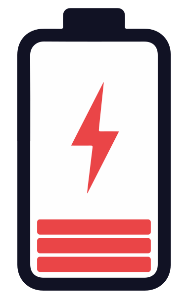
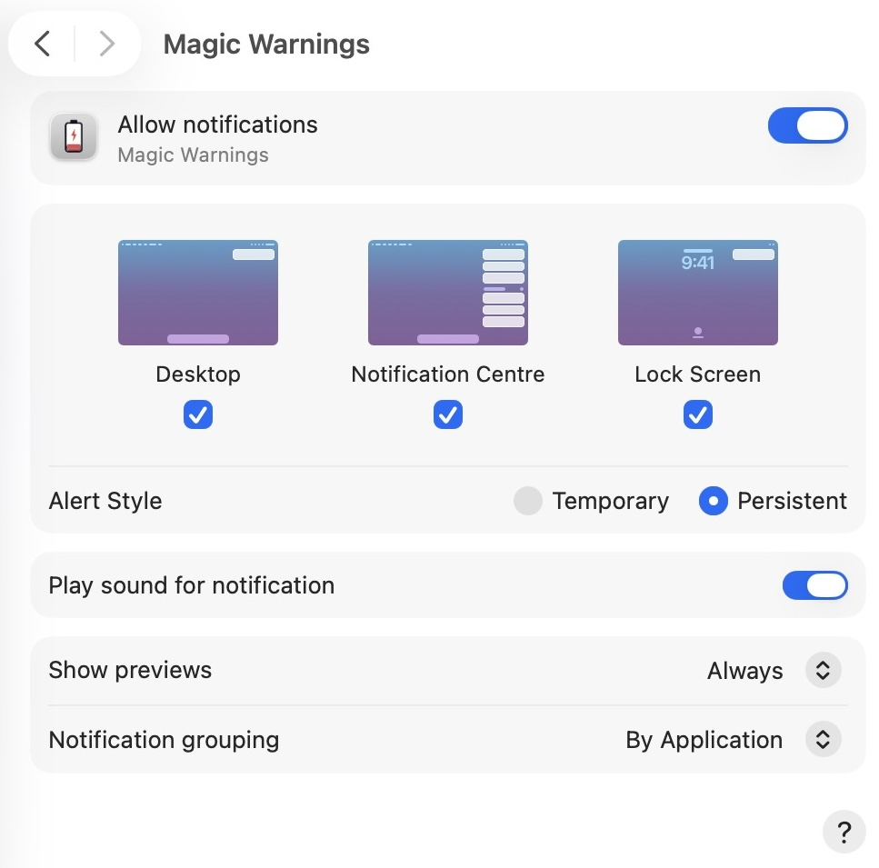
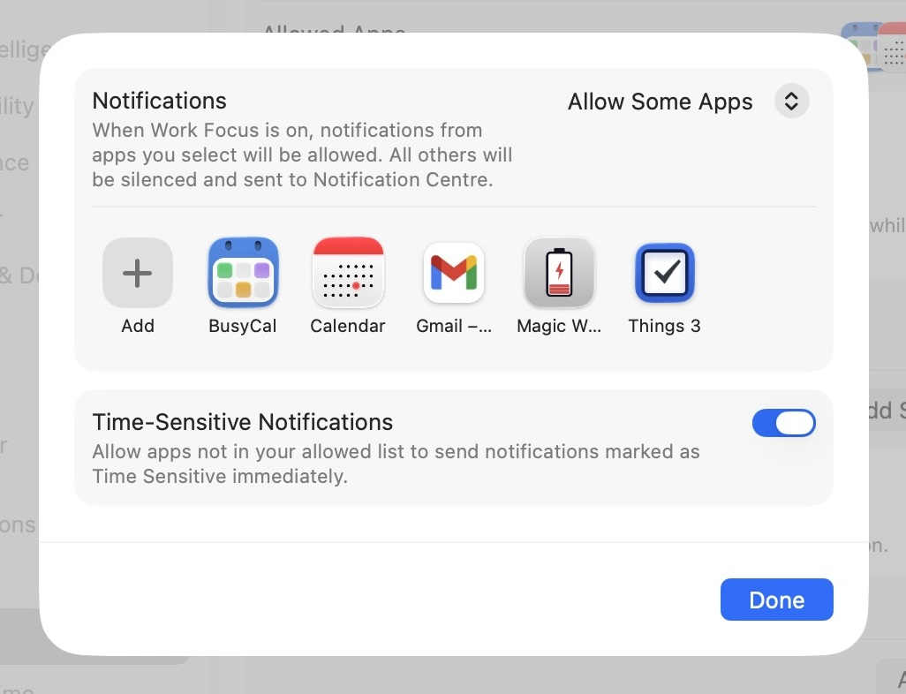

# Magic Warnings app for macOS

## Description

**Magic Warnings** is a lightweight macOS app that monitors the battery levels of your Apple Magic Mouse, Trackpad, and Keyboard and sends a notification when any device drops below 20%.

[](https://github.com/alberti42/Magic-Warnings/)

**Key features:**

- Monitors multiple Apple Magic devices simultaneously.
- Sends a system notification when any device battery drops below 20%.
- Checks battery levels automatically every 10 minutes.
- Repeats the warning every 6 hours if the battery remains low.
- Code-signed and notarized by Apple — no security warnings on first launch.

---

## Installation

1. Download the latest `.zip` from the [Releases](https://github.com/alberti42/Magic-Warnings/releases) page, extract it, and move `Magic Warnings.app` to your `/Applications` folder.

2. Launch the app. On first launch it automatically installs a background agent that runs every 10 minutes — no extra steps needed.

3. When prompted, enable notifications for **Magic Warnings** in System Settings → Notifications:

   

4. *(Optional)* Set the notification style to **Persistent** in System Settings → Notifications → **Magic Warnings**. Since the app already suppresses repeated warnings for 6 hours per device, each notification that does appear is genuinely important — a Persistent alert stays on screen until you dismiss it, whereas a Temporary banner disappears after a few seconds and is easy to miss. Left unattended, your Magic device will simply run out of battery.

5. *(Optional)* Allow notifications in Focus modes:

   

---

## Uninstallation

To remove the background agent before deleting the app, hold **Option (⌥)** and launch `Magic Warnings.app`. A dialog will appear with the option to uninstall the launcher.

After uninstalling the launcher you can move `Magic Warnings.app` to the Trash as usual.

---

## Troubleshooting

If notifications are not appearing, run the app from Terminal with `--silent --log` to print a diagnostic trace to stdout:

```bash
"/Applications/Magic Warnings.app/Contents/MacOS/applet" --silent --log
```

> **Note:** `--silent` tells the app to skip the management dialog and run the battery check directly — this is the same mode used when the background agent calls the app every 10 minutes. Without it, launching the app opens the install/uninstall dialog instead of performing a check. `--log` then enables the diagnostic output.

The output shows every device found by `ioreg`, its transport type, battery level, and the reason a notification was or was not sent. A typical session looks like this:

```
=== Magic Warnings battery check started ===
Loading timestamps from: ~/Library/Preferences/io.alberti42.magic-warnings.plist
Running: /usr/sbin/ioreg -c AppleDeviceManagementHIDEventService -r -l
Device #3: Product = "Magic Keyboard with Numeric Keypad"
Device #3: SerialNumber = "F0T75030029HVQWA8"
Device #3: Transport = "USB"
Device #3: BatteryPercent = 100%
  → skipped (Transport = "USB", not Bluetooth)
Device #4: Product = "Magic Mouse"
Device #4: SerialNumber = "20:91:DF:4F:C2:3A"
Device #4: Transport = "Bluetooth"
Device #4: BatteryPercent = 18%
  → below threshold (20%), sending notification
Device #5: Product = "Magic Trackpad"
Device #5: SerialNumber = "8C:85:90:F3:68:BA"
Device #5: Transport = "Bluetooth"
Device #5: BatteryPercent = 38%
  → OK (above threshold 20%)
=== Check complete ===
```

**Common causes of missing notifications:**

| Symptom in log | Fix |
|---|---|
| `WARNING: notification permission not granted` | Open System Settings → Notifications → Magic Warnings and enable notifications |
| Device shows `Transport = "USB"` | Device is plugged in and charging — normal, no warning needed |
| Device missing entirely from output | Device is off or not paired |
| `notification suppressed (last sent Xh ago …)` | A notification was already sent within the 6-hour suppression window — working as intended |

---

## Donations

If you find **Magic Warnings** useful, consider buying me a coffee!

[](https://buymeacoffee.com/alberti)

---

## Author

- **Author:** Andrea Alberti
- **GitHub:** [alberti42](https://github.com/alberti42)
- **Donations:** [](https://buymeacoffee.com/alberti)

Feel free to open issues or contribute in the [GitHub repository](https://github.com/alberti42/Magic-Warnings/issues).
