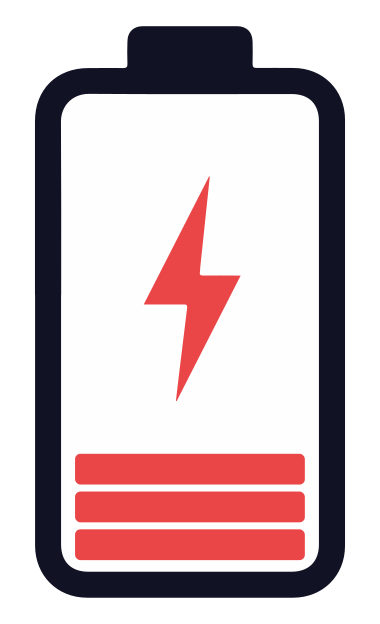
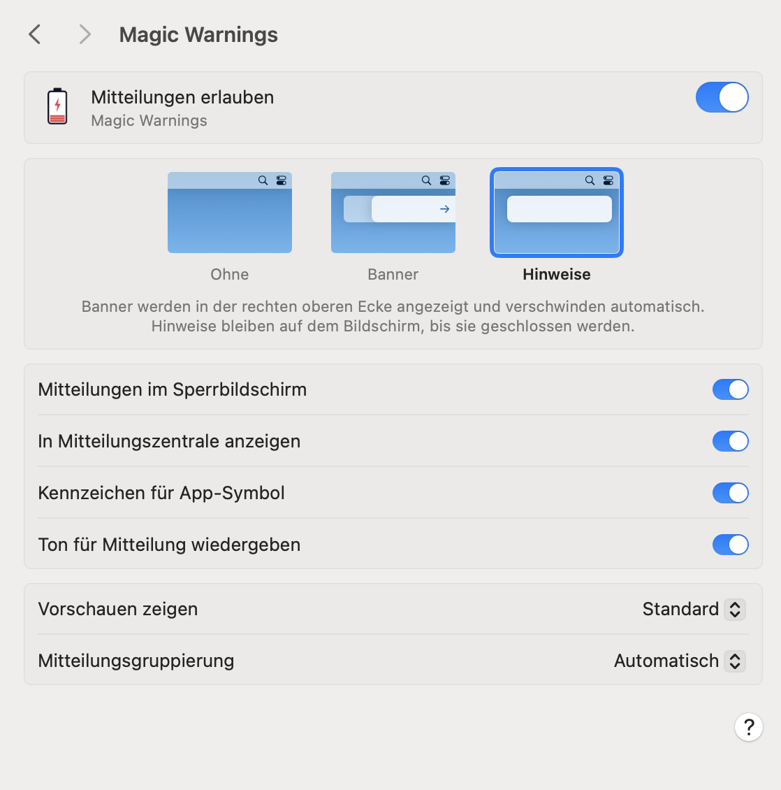
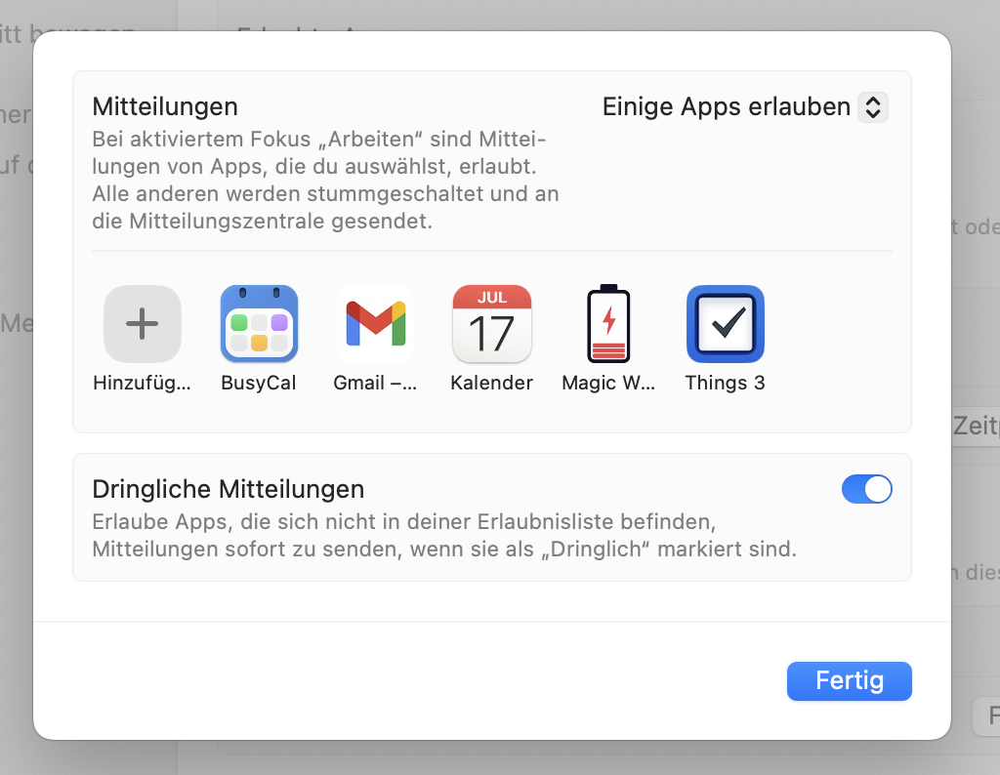

# Magic Warnings app for macOS

## Description

**Magic Warnings** is a lightweight macOS app that monitors the battery levels of your Apple Magic Mouse, Trackpad, and Keyboard and sends a notification when any device drops below 20%.

[](https://github.com/alberti42/Magic-Warnings/)

**Key features:**

- Monitors multiple Apple Magic devices simultaneously.
- Sends a system notification when any device battery drops below 20%.
- Checks battery levels automatically every 10 minutes.
- Repeats the warning every 6 hours if the battery remains low.

---

## Installation

1. Download the latest `.zip` from the [Releases](https://github.com/alberti42/Magic-Warnings/releases) page, extract it, and move `Magic Warnings.app` to your `/Applications` folder.

2. Remove the macOS quarantine flag:
   ```bash
   xattr -d com.apple.quarantine /Applications/Magic\ Warnings.app
   ```

3. Launch the app. On first launch it automatically installs a background agent that runs every 10 minutes — no extra steps needed.

4. When prompted, enable notifications for **Magic Warnings** in System Settings → Notifications:

   

5. *(Optional)* Allow notifications in Focus modes:

   

---

## Uninstallation

To remove the background agent before deleting the app, hold **Option (⌥)** and launch `Magic Warnings.app`. A dialog will appear with the option to uninstall the launcher.

After uninstalling the launcher you can move `Magic Warnings.app` to the Trash as usual.

---

## Donations

If you find **Magic Warnings** useful, consider buying me a coffee!

[](https://buymeacoffee.com/alberti)

---

## Author

- **Author:** Andrea Alberti
- **GitHub:** [alberti42](https://github.com/alberti42)
- **Donations:** [](https://buymeacoffee.com/alberti)

Feel free to open issues or contribute in the [GitHub repository](https://github.com/alberti42/Magic-Warnings/issues).
